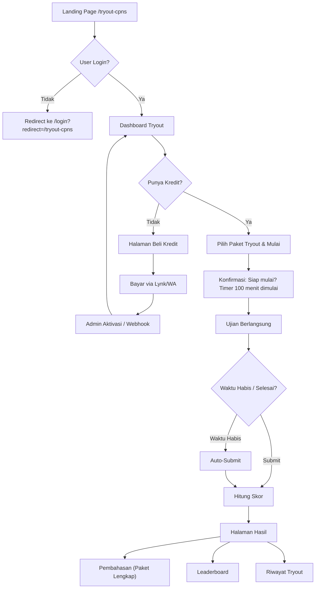

# 📋 Rencana Fitur: Tryout CPNS SKD

## 1. Ringkasan Produk

Fitur **Tryout CPNS** adalah simulasi ujian Seleksi Kompetensi Dasar (SKD) CPNS yang terdiri dari **110 soal** dengan **waktu 100 menit**, mencakup 3 subtes:

| Subtes | Jumlah Soal | Passing Grade | Bobot per Soal |
|--------|-------------|---------------|----------------|
| **TWK** (Tes Wawasan Kebangsaan) | 30 soal | 65 | Benar: 5, Salah: 0 |
| **TIU** (Tes Intelegensi Umum) | 35 soal | 80 | Benar: 5, Salah: 0 |
| **TKP** (Tes Karakteristik Pribadi) | 45 soal | 166 | Skor 1-5 per soal |

> [!IMPORTANT]
> **Skor maksimal**: TWK = 150, TIU = 175, TKP = 225 → **Total = 550**
> Peserta LULUS jika **semua subtes memenuhi passing grade** (tidak cukup total saja).

---

## 2. Model Bisnis & Pricing

### Paket Tryout

| Paket | Harga | Isi |
|-------|-------|-----|
| **Per Test (Satuan)** | Rp 15.000 | 1x akses tryout (bisa dikerjakan 1x, hasil langsung keluar) |
| **Paket Lengkap** | Rp 50.000 | 5x akses tryout + pembahasan lengkap + analisis kelemahan + leaderboard |

### Model Pembayaran
- Sama seperti sistem saat ini: **transfer manual via WhatsApp** → admin aktivasi → atau lewat **Lynk payment link**.
- Pembelian tryout **terpisah dari subscription CV Pintar** (Free/Starter/Pro). User Free pun bisa beli tryout.
- Setiap pembelian menghasilkan **"kredit tryout"** yang tersimpan di akun user.

### Lynk Payment Links (Baru)
```
Tryout Satuan : https://lynk.id/ben-yt-ai/<slug-tryout-satuan>
Tryout Lengkap: https://lynk.id/ben-yt-ai/<slug-tryout-lengkap>
```

---

## 3. User Flow (End-to-End)



---

## 4. Desain Database (Supabase/PostgreSQL)

### 4.1 Tabel: `tryout_packages`
Definisi paket tryout yang dijual.

```sql
CREATE TABLE public.tryout_packages (
  id UUID PRIMARY KEY DEFAULT gen_random_uuid(),
  slug TEXT UNIQUE NOT NULL,           -- 'satuan', 'lengkap'
  name TEXT NOT NULL,                  -- 'Tryout Satuan', 'Paket Lengkap'
  description TEXT,
  price INTEGER NOT NULL DEFAULT 0,    -- harga dalam Rupiah
  credits INTEGER NOT NULL DEFAULT 1,  -- jumlah kredit tryout
  features JSONB DEFAULT '[]'::jsonb,  -- daftar fitur paket
  has_pembahasan BOOLEAN DEFAULT false,
  has_analytics BOOLEAN DEFAULT false,
  has_leaderboard BOOLEAN DEFAULT false,
  is_active BOOLEAN DEFAULT true,
  sort_order INTEGER DEFAULT 0,
  created_at TIMESTAMPTZ DEFAULT now(),
  updated_at TIMESTAMPTZ DEFAULT now()
);
```

### 4.2 Tabel: `tryout_credits`
Kredit tryout yang dimiliki user.

```sql
CREATE TABLE public.tryout_credits (
  id UUID PRIMARY KEY DEFAULT gen_random_uuid(),
  user_id UUID NOT NULL REFERENCES auth.users(id) ON DELETE CASCADE,
  package_id UUID NOT NULL REFERENCES public.tryout_packages(id),
  total_credits INTEGER NOT NULL DEFAULT 1,
  used_credits INTEGER NOT NULL DEFAULT 0,
  remaining_credits INTEGER GENERATED ALWAYS AS (total_credits - used_credits) STORED,
  payment_method TEXT DEFAULT 'manual',  -- 'manual', 'lynk'
  payment_ref TEXT,                       -- referensi pembayaran
  activated_at TIMESTAMPTZ,
  expired_at TIMESTAMPTZ,                -- optional: batas waktu pakai
  status TEXT DEFAULT 'active' CHECK (status IN ('active', 'expired', 'refunded')),
  created_at TIMESTAMPTZ DEFAULT now(),
  
  CONSTRAINT valid_credits CHECK (used_credits >= 0 AND used_credits <= total_credits)
);
```

### 4.3 Tabel: `tryout_questions`
Bank soal tryout.

```sql
CREATE TABLE public.tryout_questions (
  id UUID PRIMARY KEY DEFAULT gen_random_uuid(),
  exam_set_id UUID NOT NULL REFERENCES public.tryout_exam_sets(id),
  subtest TEXT NOT NULL CHECK (subtest IN ('twk', 'tiu', 'tkp')),
  question_number INTEGER NOT NULL,       -- nomor urut dalam exam set
  question_text TEXT NOT NULL,             -- teks soal (bisa mengandung HTML sederhana)
  question_image_url TEXT,                 -- gambar pendukung soal (optional)
  options JSONB NOT NULL,                  -- array of {key, text, score?}
  correct_answer TEXT,                     -- key jawaban benar (TWK/TIU), null untuk TKP
  scores JSONB,                            -- {A:5,B:4,C:3,D:2,E:1} untuk TKP
  explanation TEXT,                         -- pembahasan soal
  explanation_image_url TEXT,              -- gambar pembahasan (optional)
  category TEXT,                           -- sub-kategori (misal: Pancasila, NKRI, Numerik, dll)
  difficulty TEXT DEFAULT 'medium' CHECK (difficulty IN ('easy', 'medium', 'hard')),
  created_at TIMESTAMPTZ DEFAULT now(),
  
  UNIQUE(exam_set_id, question_number)
);
```

### 4.4 Tabel: `tryout_exam_sets`
Kumpulan set soal (1 set = 110 soal = 1 ujian lengkap).

```sql
CREATE TABLE public.tryout_exam_sets (
  id UUID PRIMARY KEY DEFAULT gen_random_uuid(),
  slug TEXT UNIQUE NOT NULL,               -- 'cpns-skd-set-1'
  name TEXT NOT NULL,                      -- 'Tryout SKD CPNS Set 1'
  description TEXT,
  total_questions INTEGER DEFAULT 110,
  duration_minutes INTEGER DEFAULT 100,
  twk_count INTEGER DEFAULT 30,
  tiu_count INTEGER DEFAULT 35,
  tkp_count INTEGER DEFAULT 45,
  passing_grade_twk INTEGER DEFAULT 65,
  passing_grade_tiu INTEGER DEFAULT 80,
  passing_grade_tkp INTEGER DEFAULT 166,
  is_active BOOLEAN DEFAULT true,
  is_free_preview BOOLEAN DEFAULT false,   -- set gratis untuk preview
  sort_order INTEGER DEFAULT 0,
  created_at TIMESTAMPTZ DEFAULT now()
);
```

### 4.5 Tabel: `tryout_attempts`
Percobaan ujian user.

```sql
CREATE TABLE public.tryout_attempts (
  id UUID PRIMARY KEY DEFAULT gen_random_uuid(),
  user_id UUID NOT NULL REFERENCES auth.users(id) ON DELETE CASCADE,
  exam_set_id UUID NOT NULL REFERENCES public.tryout_exam_sets(id),
  credit_id UUID REFERENCES public.tryout_credits(id),  -- kredit yang digunakan
  
  -- Status & Timing
  status TEXT NOT NULL DEFAULT 'in_progress' 
    CHECK (status IN ('in_progress', 'completed', 'timed_out', 'abandoned')),
  started_at TIMESTAMPTZ NOT NULL DEFAULT now(),
  finished_at TIMESTAMPTZ,
  duration_seconds INTEGER,               -- waktu pengerjaan aktual
  
  -- Jawaban user (semua disimpan sebagai JSONB)
  answers JSONB DEFAULT '{}'::jsonb,       -- {questionId: "A", ...}
  
  -- Skor per subtes
  score_twk INTEGER DEFAULT 0,
  score_tiu INTEGER DEFAULT 0,
  score_tkp INTEGER DEFAULT 0,
  score_total INTEGER DEFAULT 0,
  
  -- Status kelulusan per subtes
  pass_twk BOOLEAN DEFAULT false,
  pass_tiu BOOLEAN DEFAULT false,
  pass_tkp BOOLEAN DEFAULT false,
  pass_overall BOOLEAN DEFAULT false,
  
  -- Statistik detail
  stats JSONB DEFAULT '{}'::jsonb,         -- breakdown per kategori, waktu per soal, dll
  
  created_at TIMESTAMPTZ DEFAULT now(),
  
  -- Satu user hanya bisa punya 1 attempt aktif per exam set
  CONSTRAINT one_active_attempt UNIQUE (user_id, exam_set_id, status) 
    -- Ditangani via partial unique index di migration
);
```

### 4.6 Tabel: `tryout_leaderboard` (Materialized View)
```sql
CREATE MATERIALIZED VIEW public.tryout_leaderboard AS
SELECT
  ta.user_id,
  p.full_name,
  p.avatar_url,
  ta.exam_set_id,
  es.name AS exam_name,
  ta.score_total,
  ta.score_twk,
  ta.score_tiu,
  ta.score_tkp,
  ta.pass_overall,
  ta.duration_seconds,
  ta.finished_at,
  RANK() OVER (
    PARTITION BY ta.exam_set_id 
    ORDER BY ta.score_total DESC, ta.duration_seconds ASC
  ) AS ranking
FROM public.tryout_attempts ta
JOIN public.profiles p ON p.id = ta.user_id
JOIN public.tryout_exam_sets es ON es.id = ta.exam_set_id
WHERE ta.status IN ('completed', 'timed_out')
ORDER BY ta.exam_set_id, ranking;

-- Refresh setiap ada submission baru
CREATE UNIQUE INDEX tryout_leaderboard_idx ON tryout_leaderboard(user_id, exam_set_id);
```

### 4.7 Row-Level Security (RLS)

```sql
-- tryout_credits: user hanya bisa lihat miliknya sendiri
ALTER TABLE tryout_credits ENABLE ROW LEVEL SECURITY;
CREATE POLICY "Users can view own credits" ON tryout_credits
  FOR SELECT USING (auth.uid() = user_id);
-- Insert/update hanya melalui service_role (admin/webhook)

-- tryout_attempts: user hanya bisa lihat/edit attempt miliknya
ALTER TABLE tryout_attempts ENABLE ROW LEVEL SECURITY;
CREATE POLICY "Users can view own attempts" ON tryout_attempts
  FOR SELECT USING (auth.uid() = user_id);
CREATE POLICY "Users can insert own attempts" ON tryout_attempts
  FOR INSERT WITH CHECK (auth.uid() = user_id);
CREATE POLICY "Users can update own active attempts" ON tryout_attempts
  FOR UPDATE USING (auth.uid() = user_id AND status = 'in_progress');

-- tryout_questions: semua user authenticated bisa baca soal
ALTER TABLE tryout_questions ENABLE ROW LEVEL SECURITY;
CREATE POLICY "Authenticated users can read questions" ON tryout_questions
  FOR SELECT USING (auth.role() = 'authenticated');

-- tryout_exam_sets: semua bisa baca
ALTER TABLE tryout_exam_sets ENABLE ROW LEVEL SECURITY;
CREATE POLICY "Anyone can read active exam sets" ON tryout_exam_sets
  FOR SELECT USING (is_active = true);

-- tryout_packages: semua bisa baca
ALTER TABLE tryout_packages ENABLE ROW LEVEL SECURITY;
CREATE POLICY "Anyone can read active packages" ON tryout_packages
  FOR SELECT USING (is_active = true);
```

---

## 5. Arsitektur Frontend (FE)

### 5.1 Routing (TanStack Router)

| Route | Deskripsi | Auth? |
|-------|-----------|-------|
| `/tryout-cpns` | Landing page tryout (publik, SEO-friendly) | ❌ |
| `/tryout` | Dashboard tryout (daftar set, kredit, riwayat) | ✅ |
| `/tryout/$examId` | Detail exam set + tombol mulai | ✅ |
| `/tryout/$examId/ujian` | Halaman ujian (fullscreen exam mode) | ✅ |
| `/tryout/$examId/hasil/$attemptId` | Halaman hasil + pembahasan | ✅ |
| `/tryout/leaderboard` | Leaderboard semua set | ✅ |
| `/admin/tryout` | Admin: kelola soal, set, kredit user | ✅ (admin) |

### 5.2 File & Komponen Baru

```
src/routes/
├── tryout-cpns.tsx                      # Landing page publik
├── _authenticated/
│   ├── tryout.tsx                        # Dashboard tryout
│   ├── tryout.$examId.tsx               # Detail exam set
│   ├── tryout.$examId.ujian.tsx         # Halaman ujian
│   ├── tryout.$examId.hasil.$attemptId.tsx  # Hasil & pembahasan
│   ├── tryout.leaderboard.tsx           # Leaderboard
│   └── admin/
│       └── tryout.tsx                    # Admin panel tryout

src/components/tryout/
├── ExamTimer.tsx                         # Countdown timer 100 menit
├── QuestionCard.tsx                      # Kartu soal + pilihan jawaban
├── QuestionNavigation.tsx               # Navigasi nomor soal (sidebar)
├── SubtestTabs.tsx                      # Tab TWK / TIU / TKP
├── ExamConfirmDialog.tsx                # Dialog konfirmasi mulai/submit
├── ScoreCard.tsx                        # Kartu hasil skor
├── ScoreBreakdown.tsx                   # Detail breakdown per subtes
├── PassingGradeIndicator.tsx            # Visual pass/fail per subtes
├── LeaderboardTable.tsx                 # Tabel leaderboard
├── CreditBalance.tsx                    # Widget sisa kredit
├── TryoutPackageCard.tsx                # Kartu paket pembelian
├── AttemptHistoryList.tsx               # Daftar riwayat tryout
├── QuestionExplanation.tsx              # Pembahasan soal
├── AnalyticsChart.tsx                   # Grafik performa per kategori

src/lib/
├── tryout-types.ts                      # TypeScript types
├── tryout-scoring.ts                    # Logika perhitungan skor
├── tryout-timer.ts                      # Hook & utility timer
```

### 5.3 UI/UX Design (Wireframe Kasar)

#### A. Landing Page `/tryout-cpns` (Publik)
```
┌──────────────────────────────────────────┐
│  🏛️ TRYOUT CPNS SKD 2025                │
│  Simulasi ujian yang realistis           │
│  110 soal • 100 menit • Sesuai kisi-kisi│
│                                          │
│  [Mulai Tryout - Rp 15.000]             │
│  [Paket Lengkap - Rp 50.000]            │
├──────────────────────────────────────────┤
│  📊 Kenapa Tryout di CV Pintar?         │
│  ┌─────┐ ┌─────┐ ┌─────┐ ┌─────┐       │
│  │Timer│ │Skor │ │Rank │ │Bahas│       │
│  │Real │ │Real │ │ing  │ │an   │       │
│  └─────┘ └─────┘ └─────┘ └─────┘       │
├──────────────────────────────────────────┤
│  📋 Format Ujian SKD                    │
│  TWK: 30 soal | TIU: 35 soal            │
│  TKP: 45 soal | Total: 100 menit        │
├──────────────────────────────────────────┤
│  💰 Pilih Paket                         │
│  ┌──────────────┐ ┌──────────────┐       │
│  │ SATUAN       │ │ LENGKAP ⭐   │       │
│  │ Rp 15.000    │ │ Rp 50.000    │       │
│  │ 1x tryout    │ │ 5x tryout    │       │
│  │ Hasil skor   │ │ + Pembahasan │       │
│  │              │ │ + Analytics  │       │
│  │              │ │ + Leaderboard│       │
│  │ [Beli]       │ │ [Beli]       │       │
│  └──────────────┘ └──────────────┘       │
├──────────────────────────────────────────┤
│  ❓ FAQ                                 │
│  • Soalnya mirip ujian asli?             │
│  • Bisa dikerjakan di HP?                │
│  • Passing grade berapa?                 │
└──────────────────────────────────────────┘
```

#### B. Dashboard Tryout `/tryout` (Authenticated)
```
┌──────────────────────────────────────────┐
│  👤 Halo, Bernand!                       │
│  Kredit Tryout: 3 remaining              │
│  [Beli Kredit Tambahan]                  │
├──────────────────────────────────────────┤
│  📝 Pilih Set Tryout                    │
│  ┌──────────────────────────────────┐    │
│  │ 📄 Tryout SKD Set 1              │    │
│  │ 110 soal • 100 menit             │    │
│  │ Status: Belum dikerjakan          │    │
│  │ [Mulai Tryout]                    │    │
│  └──────────────────────────────────┘    │
│  ┌──────────────────────────────────┐    │
│  │ 📄 Tryout SKD Set 2              │    │
│  │ 110 soal • 100 menit             │    │
│  │ Status: Selesai - Skor: 420/550   │    │
│  │ [Lihat Hasil] [Lihat Pembahasan]  │    │
│  └──────────────────────────────────┘    │
├──────────────────────────────────────────┤
│  📊 Riwayat Tryout                      │
│  Set 2 — 420/550 — LULUS — 2 Agt 2026   │
│  Set 1 — 380/550 — GAGAL TWK — 1 Agt    │
├──────────────────────────────────────────┤
│  🏆 Leaderboard                         │
│  1. Andi — 510/550 — 78 menit           │
│  2. Budi — 495/550 — 82 menit           │
│  3. Kamu — 420/550 — 95 menit           │
└──────────────────────────────────────────┘
```

#### C. Halaman Ujian `/tryout/$examId/ujian` (Fullscreen Exam Mode)
```
┌──────────────────────────────────────────┐
│  ⏱️ 01:23:45          TWK  TIU  TKP    │
│  Soal 5 dari 110      ████████░░░ 4.5%  │
├──────────────────────────────────────────┤
│                                          │
│  5. Pancasila sebagai dasar negara       │
│     Indonesia secara konstitusional      │
│     tercantum dalam ...                  │
│                                          │
│  ○ A. Pembukaan UUD 1945 Alinea I       │
│  ● B. Pembukaan UUD 1945 Alinea IV      │
│  ○ C. Batang Tubuh UUD 1945             │
│  ○ D. Penjelasan UUD 1945               │
│  ○ E. TAP MPR                            │
│                                          │
│  [← Sebelumnya]    [Selanjutnya →]       │
│                                          │
├──────────────────────────────────────────┤
│  Navigasi Soal:                          │
│  [1✓][2✓][3✓][4✓][5●][6○][7○]...       │
│  ✓=terjawab ●=aktif ○=belum 🚩=ragu     │
│                                          │
│  [🚩 Tandai Ragu]   [📤 Submit Ujian]   │
└──────────────────────────────────────────┘
```

#### D. Halaman Hasil `/tryout/$examId/hasil/$attemptId`
```
┌──────────────────────────────────────────┐
│  🎉 Hasil Tryout SKD Set 1              │
│  Waktu pengerjaan: 87 menit 23 detik    │
├──────────────────────────────────────────┤
│  Skor Total: 420 / 550                   │
│  ████████████████████░░░░░ 76%           │
├──────────────────────────────────────────┤
│  ┌──────────┐ ┌──────────┐ ┌──────────┐ │
│  │   TWK    │ │   TIU    │ │   TKP    │ │
│  │ 75/150   │ │ 120/175  │ │ 225/225  │ │
│  │ PG: 65   │ │ PG: 80   │ │ PG: 166  │ │
│  │ ✅ LULUS │ │ ✅ LULUS │ │ ✅ LULUS │ │
│  └──────────┘ └──────────┘ └──────────┘ │
├──────────────────────────────────────────┤
│  📊 Analisis Detail (Paket Lengkap)     │
│  • Pancasila: 4/5 benar                 │
│  • Numerik: 3/7 benar ⚠️                │
│  • Analogi: 5/6 benar                   │
│  Chart: [Bar chart per kategori]         │
├──────────────────────────────────────────┤
│  [📖 Lihat Pembahasan]                  │
│  [🔄 Coba Set Lain]                     │
│  [🏆 Leaderboard]                       │
└──────────────────────────────────────────┘
```

---

## 6. Backend (BE) — Edge Functions & API

### 6.1 Edge Functions Baru

| Function | Method | Deskripsi |
|----------|--------|-----------|
| `tryout-start` | POST | Mulai attempt baru, kurangi kredit, return soal |
| `tryout-submit` | POST | Submit jawaban, hitung skor, simpan hasil |
| `tryout-activate-credit` | POST | Admin: aktivasi kredit user setelah pembayaran |

### 6.2 `tryout-start` — Mulai Ujian

```
POST /functions/v1/tryout-start
Body: { exam_set_id: string }
Auth: Bearer token (required)
```

**Flow:**
1. Validasi user authenticated
2. Cek apakah ada attempt `in_progress` untuk exam set ini → jika ada, return attempt yang ada (resume)
3. Cek kredit user (`remaining_credits > 0`)
4. Jika tidak ada kredit → return error `{ error: 'NO_CREDITS', message: '...' }`
5. Begin transaction:
   - Increment `used_credits` di `tryout_credits` (ambil kredit paling lama dulu, FIFO)
   - Insert `tryout_attempts` dengan status `in_progress`
6. Fetch soal dari `tryout_questions` WHERE `exam_set_id` = ...
7. **JANGAN kirim `correct_answer`, `scores`, `explanation`** ke client
8. Return: `{ attempt_id, questions (tanpa jawaban), started_at, duration_minutes }`

### 6.3 `tryout-submit` — Submit Jawaban

```
POST /functions/v1/tryout-submit
Body: { attempt_id: string, answers: { [questionId]: string } }
Auth: Bearer token (required)
```

**Flow:**
1. Validasi user owns the attempt
2. Validasi attempt status = `in_progress`
3. Validasi waktu: `now() - started_at <= duration_minutes + 30 detik tolerance`
4. Fetch semua soal + jawaban benar dari DB
5. Hitung skor:
   - **TWK/TIU**: Jawaban benar = 5 poin, salah/kosong = 0
   - **TKP**: Ambil skor dari `scores` JSONB berdasarkan pilihan user
6. Tentukan pass/fail per subtes
7. Update attempt: status, scores, pass flags, duration, finished_at
8. Refresh materialized view leaderboard (async)
9. Return: hasil skor lengkap

### 6.4 `tryout-activate-credit` — Admin Aktivasi

```
POST /functions/v1/tryout-activate-credit
Body: { user_email: string, package_slug: string, payment_ref?: string }
Auth: service_role atau admin check
```

**Flow:**
1. Validasi caller is admin (via `has_role`)
2. Lookup user by email
3. Lookup package by slug
4. Insert `tryout_credits` dengan status active
5. Return: kredit yang diaktifkan

---

## 7. Logika Scoring Detail

### 7.1 TWK & TIU (Pilihan Ganda Standar)
```typescript
function scoreTwkTiu(
  answers: Record<string, string>,
  questions: Question[],
  subtest: 'twk' | 'tiu'
): number {
  let score = 0;
  for (const q of questions.filter(q => q.subtest === subtest)) {
    if (answers[q.id] === q.correct_answer) {
      score += 5; // benar = 5 poin
    }
    // salah atau kosong = 0 poin (tidak ada pengurangan)
  }
  return score;
}
```

### 7.2 TKP (Skor Bertingkat)
```typescript
function scoreTkp(
  answers: Record<string, string>,
  questions: Question[]
): number {
  let score = 0;
  for (const q of questions.filter(q => q.subtest === 'tkp')) {
    const selectedOption = answers[q.id];
    if (selectedOption && q.scores) {
      score += q.scores[selectedOption] || 1; // default 1 jika ada jawaban
    } else {
      score += 0; // kosong = 0
    }
  }
  return score;
}
```

### 7.3 Format Data Soal TKP di Database
```json
{
  "options": [
    { "key": "A", "text": "Saya akan langsung mengerjakan..." },
    { "key": "B", "text": "Saya akan berdiskusi dulu..." },
    { "key": "C", "text": "Saya akan menunggu instruksi..." },
    { "key": "D", "text": "Saya akan mendelegasikan..." },
    { "key": "E", "text": "Saya akan menolak..." }
  ],
  "scores": { "A": 5, "B": 4, "C": 3, "D": 2, "E": 1 }
}
```

---

## 8. Validasi & Keamanan

### 8.1 Anti-Cheat (Sisi Server)

| Ancaman | Mitigasi |
|---------|----------|
| Lihat jawaban di response | Jawaban benar **TIDAK** dikirim ke client saat ujian |
| Manipulasi waktu | Server menghitung `duration = finished_at - started_at`, toleransi max 30 detik |
| Double submit | Partial unique index: 1 attempt `in_progress` per user per exam set |
| Manipulasi skor | Skor **dihitung di server** (edge function), client hanya kirim jawaban |
| Replay attack | Attempt ID validated against user ownership |
| Kredit bypass | Kredit dikurangi atomically di transaction, cek `remaining_credits > 0` |
| Inspect Network | Soal dikirim tanpa jawaban; jawaban dihitung sepenuhnya di server |

### 8.2 Validasi Frontend

| Validasi | Detail |
|----------|--------|
| Timer accuracy | Timer client-side + validasi server-side, auto-submit saat habis |
| Jawaban duplikat | Satu soal = satu jawaban, overwrite jika berubah |
| Confirm sebelum submit | Dialog konfirmasi: "X soal belum dijawab. Yakin submit?" |
| Browser close warning | `beforeunload` event: "Ujian sedang berlangsung, yakin keluar?" |
| Session persistence | Jawaban auto-save ke `localStorage` sebagai backup, tapi source of truth tetap server |
| Network offline | Deteksi offline, tampilkan warning, retry submit saat online |

### 8.3 RLS & Authorization

```
┌─────────────────────────────────────────────────────┐
│ Resource              │ SELECT │ INSERT │ UPDATE │ DELETE │
├───────────────────────┼────────┼────────┼────────┼────────┤
│ tryout_packages       │ all    │ admin  │ admin  │ admin  │
│ tryout_exam_sets      │ all    │ admin  │ admin  │ admin  │
│ tryout_questions      │ auth   │ admin  │ admin  │ admin  │
│ tryout_credits        │ own    │ svc    │ svc    │ -      │
│ tryout_attempts       │ own    │ own    │ own*   │ -      │
│ tryout_leaderboard    │ auth   │ -      │ -      │ -      │
└─────────────────────────────────────────────────────┘
* update hanya untuk status = 'in_progress'
```

### 8.4 Rate Limiting
- `tryout-start`: Max 5 requests/menit per user
- `tryout-submit`: Max 3 requests/menit per user
- `tryout-activate-credit`: Admin only, no public rate limit

---

## 9. Auto-Save & Resume

### 9.1 Auto-Save Strategy
```
Client (setiap 30 detik):
  1. Ambil state jawaban dari React state
  2. Simpan ke localStorage: tryout_answers_{attemptId}
  3. Juga kirim PATCH ke tryout_attempts.answers via Supabase client
     (karena RLS mengizinkan UPDATE untuk own + in_progress)

Resume Flow:
  1. User buka /tryout/$examId/ujian
  2. Cek apakah ada attempt in_progress untuk exam set ini
  3. Jika ada → load soal + jawaban yang sudah tersimpan
  4. Hitung sisa waktu: duration_minutes - (now - started_at)
  5. Jika sisa waktu <= 0 → auto-submit
  6. Jika masih ada waktu → lanjutkan ujian
```

### 9.2 Auto-Submit saat Waktu Habis
```typescript
// Di ExamTimer.tsx
useEffect(() => {
  const remaining = calculateRemainingSeconds(attempt.started_at, 100 * 60);
  if (remaining <= 0) {
    submitExam({ attempt_id, answers, auto_submit: true });
    return;
  }
  const timer = setTimeout(() => {
    submitExam({ attempt_id, answers, auto_submit: true });
  }, remaining * 1000);
  return () => clearTimeout(timer);
}, []);
```

---

## 10. Admin Panel — Manajemen Soal

### 10.1 Fitur Admin Tryout

| Fitur | Deskripsi |
|-------|-----------|
| CRUD Exam Set | Buat, edit, hapus set tryout |
| CRUD Soal | Input soal per set, bulk import via JSON/CSV |
| Aktivasi Kredit | Aktivasi kredit user setelah transfer |
| Statistik | Jumlah peserta, rata-rata skor, distribusi |
| Preview Soal | Preview tampilan soal sebelum publish |

### 10.2 Bulk Import Soal (JSON)
```json
{
  "exam_set_slug": "cpns-skd-set-1",
  "questions": [
    {
      "subtest": "twk",
      "question_number": 1,
      "question_text": "Pancasila sebagai dasar negara tercantum dalam...",
      "options": [
        { "key": "A", "text": "Pembukaan UUD 1945 Alinea I" },
        { "key": "B", "text": "Pembukaan UUD 1945 Alinea IV" },
        { "key": "C", "text": "Batang Tubuh UUD 1945" },
        { "key": "D", "text": "Penjelasan UUD 1945" },
        { "key": "E", "text": "TAP MPR" }
      ],
      "correct_answer": "B",
      "explanation": "Pancasila sebagai dasar negara tercantum dalam Pembukaan UUD 1945 Alinea IV...",
      "category": "Pancasila"
    },
    {
      "subtest": "tkp",
      "question_number": 66,
      "question_text": "Anda diminta menyelesaikan tugas mendadak...",
      "options": [
        { "key": "A", "text": "Langsung mengerjakan" },
        { "key": "B", "text": "Berdiskusi dulu" },
        { "key": "C", "text": "Menunggu instruksi" },
        { "key": "D", "text": "Mendelegasikan" },
        { "key": "E", "text": "Menolak" }
      ],
      "scores": { "A": 5, "B": 4, "C": 3, "D": 2, "E": 1 },
      "explanation": "Sikap yang paling tepat adalah langsung mengerjakan...",
      "category": "Pelayanan Publik"
    }
  ]
}
```

---

## 11. SEO & Landing Page

### 11.1 Meta Tags
```typescript
export const Route = createFileRoute('/tryout-cpns')({
  head: () => ({
    meta: buildSeo({
      title: 'Tryout CPNS SKD Online 2025 - Simulasi Ujian Realistis | CV Pintar',
      description: 'Latihan soal CPNS SKD online: 110 soal, 100 menit, TWK TIU TKP sesuai kisi-kisi resmi. Skor real-time, pembahasan lengkap, dan leaderboard.',
      path: '/tryout-cpns',
    }),
  }),
});
```

### 11.2 Structured Data (JSON-LD)
```json
{
  "@context": "https://schema.org",
  "@type": "Product",
  "name": "Tryout CPNS SKD Online",
  "description": "Simulasi ujian CPNS SKD lengkap dengan 110 soal, timer 100 menit, dan pembahasan.",
  "offers": [
    {
      "@type": "Offer",
      "name": "Tryout Satuan",
      "price": "15000",
      "priceCurrency": "IDR"
    },
    {
      "@type": "Offer",
      "name": "Paket Lengkap",
      "price": "50000",
      "priceCurrency": "IDR"
    }
  ]
}
```

---

## 12. Integrasi dengan Sistem Existing

### 12.1 Dashboard CV Pintar
- Tambah card "Tryout CPNS" di dashboard user (`/dashboard`)
- Tampilkan sisa kredit dan skor terakhir

### 12.2 Navigasi
- Tambah link di navigasi sidebar/bottom nav (opsional, atau di dashboard saja)
- Tambah halaman `/tryout-cpns` ke `sitemap.xml`

### 12.3 Knowledge Base Update
- Update [knowladge-based.md](file:///Users/bernanddayamuntarihermawan/Documents/cv-ats/knowladge-based.md) dengan info fitur tryout
- Tambah FAQ tryout di AI chat knowledge

### 12.4 Payment Flow
- Sama seperti subscription: transfer manual via WA atau Lynk
- Admin aktivasi kredit lewat admin panel (`/admin/tryout`)

---

## 13. Tahapan Implementasi (Roadmap)

### Phase 1: Foundation (3-4 hari)
- [x] Migration: buat semua tabel database
- [x] Seed: insert tryout_packages (satuan & lengkap)
- [x] Seed: insert 1 exam set + 110 soal sample
- [x] RLS policies
- [x] TypeScript types (`tryout-types.ts`)
- [x] Scoring utility (`tryout-scoring.ts`)

### Phase 2: Core Exam Flow (4-5 hari)
- [x] Edge function: `tryout-start`
- [x] Edge function: `tryout-submit`
- [x] Halaman ujian: timer, soal, navigasi, submit
- [x] Auto-save jawaban
- [x] Auto-submit saat waktu habis
- [x] Halaman hasil + skor breakdown

### Phase 3: Purchase & Credits (2-3 hari)
- [x] Halaman beli kredit
- [x] Edge function: `tryout-activate-credit`
- [x] Admin panel: aktivasi kredit user
- [ ] Integrasi Lynk payment links (butuh URL Lynk aktual)

### Phase 4: Landing & SEO (1-2 hari)
- [x] Landing page `/tryout-cpns` (publik)
- [x] SEO meta tags & structured data
- [x] Sitemap update
- [x] Dashboard card

### Phase 5: Enhancement (2-3 hari)
- [x] Pembahasan soal (paket lengkap)
- [x] Leaderboard
- [x] Analisis per kategori
- [x] Riwayat tryout
- [ ] Admin: bulk import soal (belum diimplementasi)

### Phase 6: Polish & QA (1-2 hari)
- [x] Responsive design (mobile-first)
- [x] Dark mode support
- [x] Edge case testing (review kode & anti-cheat)
- [x] Security audit (RLS + server-side scoring + anti-cheat)
- [x] Knowledge base update

**Estimasi total: ~2-3 minggu**

---

## 14. Risiko & Mitigasi

| Risiko | Dampak | Mitigasi |
|--------|--------|----------|
| Soal bocor ke publik | Tinggi | Soal tersimpan di DB, tidak di-cache di client, randomisasi urutan soal per attempt |
| Timer inaccuracy | Sedang | Server-side validation, toleransi 30 detik |
| Payment dispute | Rendah | Bukti transfer via WA, referensi pembayaran tersimpan |
| Concurrent submit | Sedang | Partial unique index, transaction locking |
| Large exam set (perf) | Rendah | 110 soal = ~50KB JSON, lazy load pembahasan |

---

## 15. Open Questions

> [!IMPORTANT]
> **Pertanyaan untuk diputuskan sebelum implementasi:**

1. **Sumber soal**: Apakah sudah ada bank soal yang siap, atau perlu AI generate soal sample dulu?
2. **Randomisasi soal**: Apakah urutan soal diacak per attempt atau fixed per exam set?
3. **Expiry kredit**: Apakah kredit tryout punya batas waktu pakai (misal 3 bulan)?
4. **Free preview**: Mau kasih 5-10 soal gratis sebagai preview sebelum beli?
5. **Leaderboard privacy**: Tampilkan nama asli atau anonymous (User123)?
6. **Integrasi subscription**: Apakah user Pro mendapat 1 kredit tryout gratis per bulan sebagai benefit?
7. **Multiple attempt**: Jika user beli paket satuan, boleh ulang exam set yang sama (pakai kredit baru) atau harus beda set?
8. **Mobile UX**: Ujian fullscreen di HP bisa tricky — mau pakai landscape lock atau tetap portrait?
